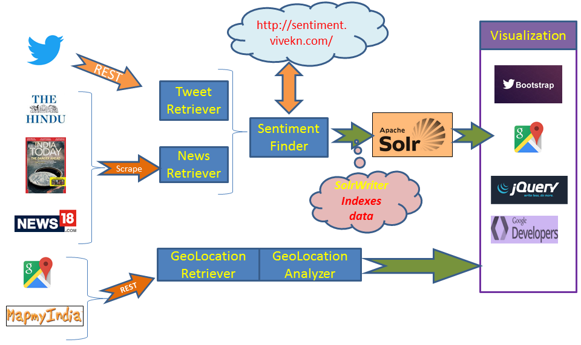

# Big And Far Math Challenge @ ICC - Demonetization
The goal of this challenege is to explore how data science could have helped the whole process of Demonetization smoother.
As part of this challenge few Primary and secondary questions were suggested. A participant is supposed to come up with analytical approach to answer one or more questions out of those.

#### Check Visualization @ [https://amitlondhe.github.io/bigfarmathchallenge/index-static.html](https://amitlondhe.github.io/bigfarmathchallenge/index-static.html)

# Solution
I have tried to answer few questions mentioned below. In the process I collected data from various sources such as Twitter, News portals and Geospatial data sources (Google Maps and MapMyIndia). The source code is included as well in this repository.
The actual solution fetches the data required to render visualization dynamically deployed on Apache Solr server. However static version of the same that uses snapshot of the data is being published through this repository.

The Primary and secondary questions are mentioned below along with the approach followed.

* Where should banks have considered placing mobile ATMs to best speed up the process?
  * Gathered GeoSpatial data for few Hospitals and Schools in Mumbai using Google Maps
  * Used MapMyIndia’s NearBy APIs to find out ATMs near this Point of Interests
  * Mark as Desert if the POI does not have “n” ATMs within 1 mile
    * Note: Visualization shows one Desert for Illustration purpose even though it has "n" ATMs within a mile radius.

* To what extent does social media data support the study and analysis of the effects of demonetization?
  * Downloaded tweets (last few days of Nov’16) from kaggle dataset https://www.kaggle.com/smugglaz/demonetizingindia 
  * Ingested the Tweets using Twitter REST APIs (can only download past 7 days worth of data free)
  * Analyzed those tweets for sentiments using Online API provided by http://sentiment.vivekn.com/api/text/ 
  * Rendered Google Stacked Bar, Scatter charts and word tree as Visualization.

* To what extent does social media data support the study and analysis of the effects of demonetization?
  * News headlines collected from different sources (The Hindu, News18, IndiaToday)
  * Run through sentiment analysis
  * Rendered Google Stacked Bar, Scatter charts and word tree as Visualization.

# Solution Diagram

